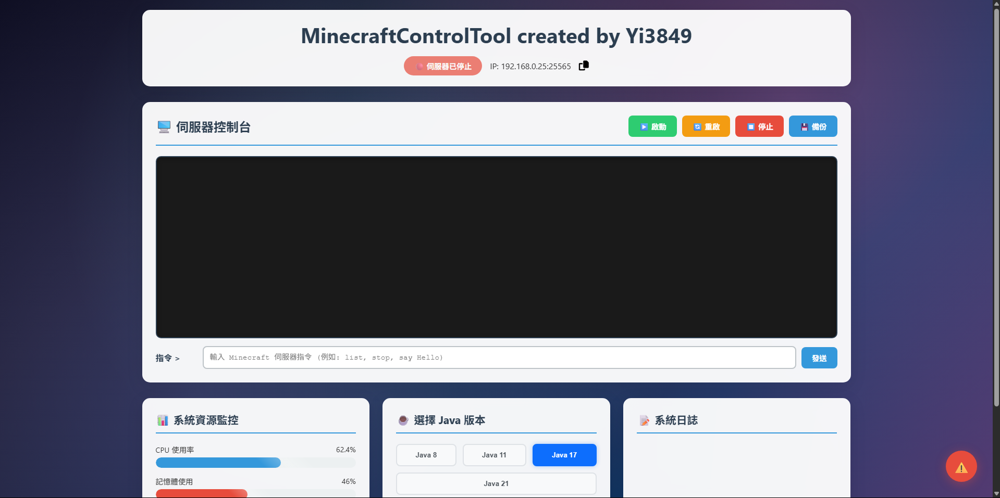

# 🖥️ MinecraftControlTool

MinecraftControlTool 是一個基於 Python Flask 的 Minecraft 伺服器管理工具，提供現代化網頁介面來控制、監控並管理你的伺服器。此專案由 Yi3849 開發，致力於讓伺服器管理更加簡單、直覺、實用。

## 🌟 功能特色

- 🔌 啟動 / 停止 / 重啟 Minecraft 伺服器
- 🧠 即時系統資源監控（CPU、記憶體、磁碟空間）
- ☕ 一鍵選擇 Java 執行版本（支援 Java 8、11、17、21）- 尚未完成
- 📜 系統日誌查看 - 尚未完成
- 💬 實時控制台與指令輸入
- 🧠 使用 Socket.IO 獲取即時資源使用率
- 🧩 支援多伺服器配置管理
- 💾 一鍵備份伺服器 - 尚未完成

---

## 🔧 環境需求

- Python 3.11+
- 作業系統：Windows / macOS / Linux（跨平台）- 建議於Windows使用

## 🖼️ 圖片預覽




## 📦 安裝教學

1. **Clone 專案**

```bash
git clone https://github.com/willy3849/MinecraftControlTool.git
cd MinecraftControlTool
